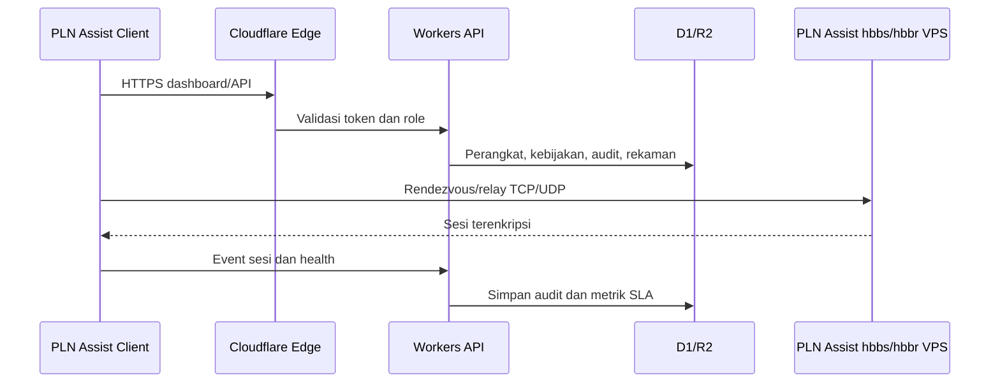
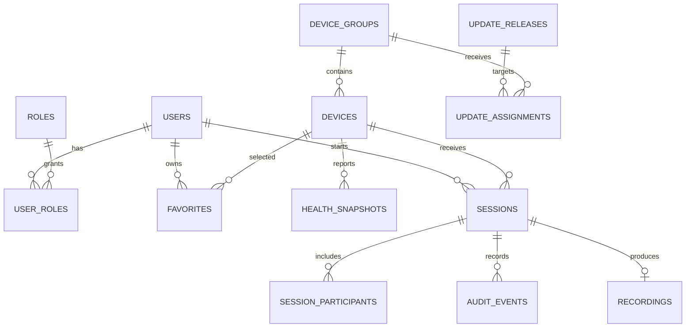

# PLN Assist

## 1. Overview

PLN Assist adalah aplikasi bantuan jarak jauh desktop dan mobile berbasis PLN Assist 1.4.9. Aplikasi memusatkan koneksi perangkat, dukungan teknisi, pemantauan kesehatan perangkat, dan jejak audit tanpa memakai relay publik.

Tujuan MVP:

- Pengguna utama: teknisi dan pegawai dengan role Biller, Admin, PBM, SPV, atau Umum.
- Aksi pertama: pilih perangkat lalu mulai sesi remote dengan persetujuan atau password perangkat.
- Tiga fitur wajib: remote aman, pengelolaan perangkat, audit sesi.
- Kelebihan: server organisasi, role per grup perangkat, prioritas input pengguna lokal.
- Alasan kembali: perangkat favorit, sesi bertab, status perangkat, reconnect cepat.

## 2. Requirements

- Desktop: Windows menjadi target pertama; macOS dan Linux mengikuti setelah build Windows stabil.
- Mobile: Android menjadi target pertama; iOS mengikuti setelah identitas signing tersedia.
- Aksesibilitas: kontrol berlabel, fokus keyboard jelas, kontras cukup, skala teks tidak merusak layout.
- Autentikasi remote: persetujuan pengguna atau password unattended access yang diaktifkan pada perangkat tujuan.
- Password: tidak disimpan plaintext; wajib rate limit, lockout, pencabutan, dan audit.
- Data perangkat: ID, nama, unit, lokasi, OS, pengguna, grup, status, versi aplikasi, CPU, RAM, disk, uptime, antivirus.
- Notifikasi: koneksi masuk, teknisi bergabung, timeout, update, status input lokal, dan emergency disconnect.
- Aktivitas fisik pada perangkat tujuan menghentikan input remote selama 5 detik. Video tetap berjalan.
- OT/SCADA tidak termasuk ruang lingkup MVP dan harus dipisahkan dari perangkat kantor.

## 3. Core Features

1. Remote support
   - Persetujuan interaktif.
   - Password unattended access.
   - Reboot dan reconnect otomatis.
   - Tombol reconnect manual setelah timeout/putus.
   - Multi-monitor, clipboard, transfer file, chat.

2. Manajemen sesi
   - Tabbed sessions untuk dua atau lebih perangkat.
   - Invite technician ke sesi aktif.
   - Session timeout.
   - Emergency disconnect dan revoke.

3. Manajemen perangkat
   - Inventaris perangkat.
   - Device groups.
   - Favorites.
   - Wake-on-LAN.
   - Health monitoring.
   - Remote update terpusat.

4. Kontrol keamanan
   - Role: Admin, SPV, PBM, Biller, Umum.
   - Allowlist dan blocklist akun/perangkat.
   - Audit waktu, aktor, perangkat, hasil, transfer file, dan perubahan konfigurasi.
   - Rekaman sesi tanpa kolom alasan akses.

5. Operasional
   - Dashboard SLA: jumlah sesi, waktu respons, durasi penanganan, perangkat bermasalah, teknisi aktif.
   - Mode jaringan lambat.
   - Branding dan konfigurasi server bawaan.

## 4. User Flow

1. Admin login dan memantau perangkat, sesi aktif, kesehatan, serta SLA.
2. Admin mengatur role, device group, allowlist/blocklist, timeout, dan kanal update.
3. Teknisi memilih perangkat dari group/favorite lalu memulai koneksi.
4. Perangkat tujuan menyetujui koneksi atau memvalidasi password unattended access.
5. Sesi aktif menampilkan chat, transfer file, invite technician, reboot, dan emergency disconnect sesuai izin.
6. Aktivitas lokal mengunci input remote selama 5 detik dan menampilkan status pada teknisi.
7. Setelah sesi selesai, audit, metrik SLA, dan rekaman diperbarui.
8. Admin memverifikasi hasil, mencabut sesi/perangkat bila perlu, lalu menerbitkan update terpusat.

## 5. Architecture

Cloudflare Pages/Workers menangani dashboard dan API HTTP. D1 menyimpan metadata/RBAC/audit, R2 menyimpan rekaman dan paket update. `hbbs`/`hbbr` tetap berjalan pada VPS Linux/Docker karena membutuhkan koneksi TCP/UDP panjang. DNS memakai Cloudflare DNS-only; Spectrum hanya opsi berbayar.

## 6. Database Schema

- `users`: akun teknisi/pengguna dan status.
- `roles`, `user_roles`: Admin, SPV, PBM, Biller, Umum dan cakupan izinnya.
- `device_groups`, `devices`: inventaris dan pengelompokan perangkat.
- `favorites`: perangkat favorit per pengguna.
- `health_snapshots`: CPU, RAM, disk, uptime, antivirus, versi.
- `sessions`, `session_participants`: sesi remote dan teknisi yang bergabung.
- `audit_events`: koneksi, transfer, reboot, update, block/revoke, emergency disconnect.
- `recordings`: metadata dan lokasi objek R2.
- `update_releases`, `update_assignments`: paket, kanal, target grup, status rollout.

## 7. Design & Technical Constraints

- Basis kode: PLN Assist 1.4.9, Rust 1.75, Flutter 3.24.5.
- UI Flutter existing dipertahankan; fitur upstream dipakai sebelum membuat ulang.
- Client desktop/mobile dibangun dari codebase yang sama.
- Backend manajemen dibuat terpisah dari `hbbs`/`hbbr`.
- Input lokal selalu lebih tinggi prioritas daripada input remote.
- Build rilis wajib signing; identifier aplikasi final menunggu identitas organisasi resmi.
- Nama dan logo PLN hanya boleh dirilis setelah ada izin merek/aset resmi.
- Lisensi AGPL-3.0 dan kewajiban distribusi source harus dipenuhi.
- Typography: variable sans untuk UI, serif tidak digunakan, mono untuk ID/log/diagnostik.
- Ikon upstream dipakai sementara sampai aset resmi PLN Assist tersedia.
